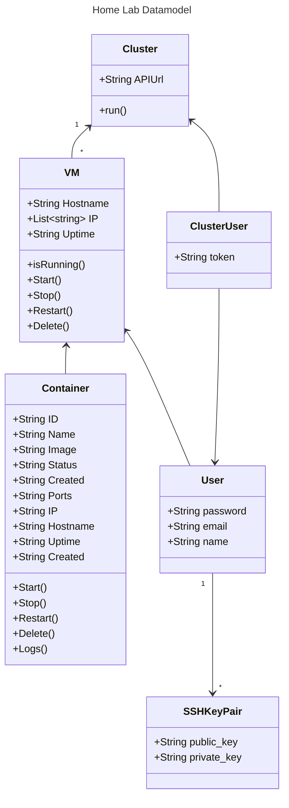

# Datamodel

## Entities

- ProxmoxCluster
- K8SCluster
- User
- ClusterUser
- SSHKeyPair
- VM
- Container
- DNSEntry

```mermaid
---
title: Home Lab Datamodel
---
classDiagram
    Cluster "1" <-- "*" VM
    Cluster <-- ClusterUser
    VM <-- Container
    VM <-- User
    ClusterUser --> User
    User "1" --> "*" SSHKeyPair

    class VM{
        +String Hostname
        +List~string~ IP
        +String Uptime
        +isRunning()
        +Start()
        +Stop()
        +Restart()
        +Delete()
    }
    
    class Container{
        +String ID
        +String Name
        +String Image
        +String Status
        +String Created
        +String Ports
        +String IP
        +String Hostname
        +String Uptime
        +String Created
        +Start()
        +Stop()
        +Restart()
        +Delete()
        +Logs()
    }
    class ClusterUser{
        +String token
    }
    class User{
        +String password
        +String email
        +String name
    }
    class SSHKeyPair{
        +String public_key
        +String private_key
    }

    class Cluster{
        +String APIUrl
        +run()
    }
```